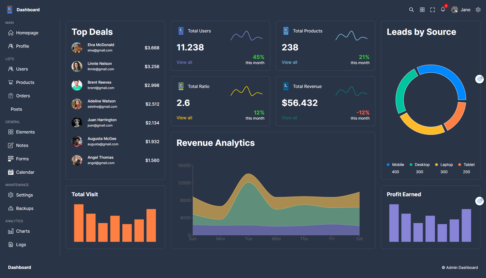

# Admin-Dashboard-UI-Reactjs

The "React Admin Dashboard" website is a platform that provides an administrative dashboard built using ReactJS technology. It is designed to offer a user-friendly interface for managing and controlling various aspects of an application or system. The dashboard provides features and components specifically tailored for administration purposes, such as data visualization, analytics, user management, and customizable settings. It aims to simplify the process of monitoring and managing the backend of an application, making it easier for administrators to track and control different aspects of their system.


## Demo

https://admin-dashboard-ui-reactjs.vercel.app/


## Tech Stack

**Client:** React, React-router-dom, Typescript, HTML, Css, Material UI (MUI), SASS(SCSS) and rechartjs library for chart


## Development

```bash
  npm run dev
```


## Screenshots



